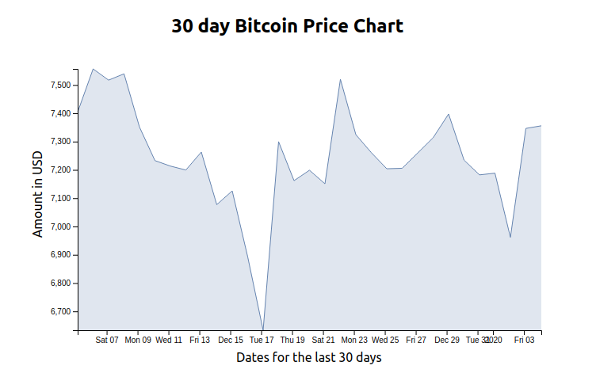

I’ve been working with React and D3 for the last 2 years building custom interactive charts for both startups and well established companies across the world in my remote work endeavors :). In that time, I’ve really enjoyed the flexibility I get while making visualizations with these tools and I’ll share my vast experience with you. Yes, you!

Some people like to look at data visualization as an efficient way of conveying a story, telling some interesting insight somebody has discovered in data and they want to share it with their audience. It’s often said that a picture represents a thousand words and I also like to think data visualization works the same way.

In this blog post, we shall use D3, an almost perfect flexible JavaScript library to build a custom 30 day bitcoin price chart powered by coindesk while leveraging React, a JavaScript library for building user interfaces.

Here is what we shall build and what I’ll be walking you through this article.

Before I got started with D3, I had to do some home work to make sure I was putting my faith on a decent technology and my findings on both npm and GitHub gave me the green light.

### D3 has:

- Over 474,000 weekly downloads on npm.

- Over 89,000 stars on GitHub.

- 228 releases to date.

- Over 3,000 dependent packages.

- And it’s been around for some good 8 years now.

## Implementation of the bitcoin price chart

All I needed to have my 30 day bitcoin price chart was:

### Root component

- Fetching raw data from the [free coindesk API](https://api.coindesk.com/v1/bpi/historical/close.json). Note that coindesk is a news site specializing in bitcoin and digital currencies.

- Manages updates to the raw data

- Manages state for interactions that require redrawing of charts (filter, aggregate, sort, etc.)

### Child component

- Gets passed in raw data as prop.

- Translates raw data to screen space.

- Renders the calculated data.

- Manages state for interactions that don’t require redrawing of the chart (hover, click).

### Where to calculate data

- We shall calculate our data from getDerivedStateFromProps method because it is simple and straightforward. You should also note that D3 calculations can go anywhere (that makes sense for your project) as long as React can access it in its render function.

> Never ever let D3 and React manage same parts of the DOM! OR BUGS!! — Shirley Wu

### D3 axes

- Axes are very important in making the data readable, and D3 makes it easy in creating them.

- Create _axisLeft()_ or _axisBottom()_ at beginning of a React lifecycle and set corresponding scale.

- Create an _svg_ group element inside the _render_ method.

- Call axis on the group element in _componentDidUpdate_.

## Here is how I did it.

<iframe src='https://gfycat.com/ifr/SlimTheseAfricanbushviper' frameborder='0' scrolling='no' allowfullscreen width='100%' height='490'></iframe>

To get started real quick on this project, I bootstrapped the application with create-react-app, a comfortable environment for learning React, and probably best way to start building a new single-page application in React. Under the hood, it uses Babel and webpack, but you don’t need to know anything about them.

I’ll start with code in my root component, `App.js` which is responsible for fetching data from the free coindesk API, formatting the raw data and passing it to the child component as a prop.

### **App.js**

    import React from "react";
    import Chart from "./Chart";

    class App extends React.Component {
    constructor(props) {
    super(props);
    this.state = {
        data: []
    };
    }
    componentDidMount() {
    fetch(`https://api.coindesk.com/v1/bpi/historical/close.json`)
        .then(response => response.json())
        .then(data => {
        this.setState({
        data: Object.keys(data.bpi).map(date => {
        return {
            date: new Date(date),
            price: data.bpi[date]
            };
        })
        });
    })
    .catch(error => console.log(error));
    }

    render() {
    const { data } = this.state;
    return (
        

        <h2 style={{ textAlign: "center" }}>
            30 day Bitcoin Price Chart
        </h2>
        <Chart data={data} />
        

        );
    }
    }
    export default App;

Okay, I understand this is somewhat a lot of code but I’ll try to break it down. What you should focus on is the fetch browser API inside the _componentDidMount_ lifecycle method. When the component is mounted and before the render method is called, A fetch request is made to the coindesk API which returns a promise that is handled appropriately using [JavaScript promises](https://developer.mozilla.org/en-US/docs/Web/JavaScript/Reference/Global_Objects/Promise).

The bitcoin price index(bpi) data returned is in this format `"2019-12-05":7404.4033` in an array hence the need to format the dates to actual date objects instead of strings before adding it to state. These actual date objects will be helpful while creating the scale for the horizontal axis on the actual graph. This data is then passed to the child component as props.

### **Chart.js**

    import React from "react";
    import * as d3 from "d3";

    const width = 650;
    const height = 400;
    const margin = {
    top: 20,
    right: 5,
    bottom: 50,
    left: 60
    };

    class Chart extends React.Component {
    constructor(props) {
        super(props);
        this.state = {
        data: null
        };
    }
    xAxis = d3.axisBottom();
    yAxis = d3.axisLeft();

    static getDerivedStateFromProps(nextProps, prevState) {
    const { data } = nextProps;

    if (!data) return {};
    const xExtent = d3.extent(data, d => d.date);
    const yExtent = d3.extent(data, d => d.price);
    const xScale = d3
        .scaleTime()
        .domain(xExtent)
        .range([margin.left, width - margin.right]);

    const yScale = d3
        .scaleLinear()
        .domain(yExtent)
        .range([height - margin.bottom, margin.top]);

    const line = d3
        .line()
        .x(d => xScale(d.date))
        .y(d => yScale(d.price));

    const minY = d3.min(data, d => d.price);

    const area = d3
        .area()
        .x(d => xScale(d.date))
        .y0(d => yScale(minY))
        .y1(d => yScale(d.price));

    return { xScale, yScale, data, line, area };
    }

    componentDidUpdate() {
        this.xAxis.scale(this.state.xScale);
        d3.select(this.refs.xAxis).call(this.xAxis);
        this.yAxis.scale(this.state.yScale);
        d3.select(this.refs.yAxis).call(this.yAxis);
    }

    render() {
    const styles = {
        container: {
        display: "grid",
        justifyItems: "center"
        }
    };

    const { data, line, area } = this.state;

    return (
        

        <svg width={width} height={height}>
            <path
            id={"line"}
            d={line(data)}
            stroke="#6788ad"
            fill="transparent"
            />
            <path
            id={"area"}
            d={area(data)}
            fill="#6788ad"
            style={{ opacity: 0.2 }}
            />
            <text
            transform={`translate(${width / 2 - margin.left -margin.right}, ${height - 10})`}
            >
            Dates for the last 30 days
            </text>
            <text
            transform={`translate(15, ${(height - margin.bottom) /1.5}) rotate(270)`}
            >
            Amount in USD
            </text>
            <g
            ref="xAxis"
            transform={`translate(0, ${height - margin.bottom})`}
            />
            <g ref="yAxis" transform={`translate(${margin.left}, 0)`} />
        </svg>
        

    );
    }
    }
    export default Chart;

Okay I know this is really a lot of code because it’s where the heavy lifting takes place. You shouldn’t be worried though, I got you on this! Let’s start breaking it down.

<iframe src='https://gfycat.com/ifr/DisastrousBlondArrowana' frameborder='0' scrolling='no' allowfullscreen width='100%' height='447'></iframe>

None of the following steps is very difficult, it’s just chaining them all together that was a little tricky, at first.

Before anything else, you need to first install D3 from npm or yarn.

For npm users, use the command `npm install d3` and for yarn users, use the command `yarn add d3`

## Step 1 — Receiving the data

    const { data } = nextProps;

    if (!data) return {};

Our focus in file should be on the _getDerivedStateFromProps_ method in the Chart component. It receives props from the root component and pulls of the data prop. If the data is not available, it will do nothing.

## Step 2 — Calculating the horizontal and vertical scales

    const xExtent = d3.extent(data, d => d.date);

    const yExtent = d3.extent(data, d => d.price);

    const xScale = d3
        .scaleTime()
        .domain(xExtent)
        .range([margin.left, width - margin.right]);

    const yScale = d3
        .scaleLinear()
        .domain(yExtent)
        .range([height - margin.bottom, margin.top]);

If the data is available, the both the horizontal and vertical scales are calculated by leveraging D3’s `scaleTime()` `scaleLinear()` methods. The results are stored in the _xScale_ and _yScale_ variables respectively. In both cases, the margin is considered while specifying the array values for the range.

## Step 3 — Calculating the line and area

    const line = d3
        .line()
        .x(d => xScale(d.date))
        .y(d => yScale(d.price));

    const minY = d3.min(data, d => d.price);

    const area = d3
        .area()
        .x(d => xScale(d.date))
        .y0(d => yScale(minY))
        .y1(d => yScale(d.price));

    return { xScale, yScale, data, line, area };

The line and area of the chart are also calculated by leveraging D3’s `line()` and `area()` methods and the results stored in the line and area variables respectively. The _getDerivedStateFromProps_ method will then return the xScale, yScale, line and area variables together with the data prop which can then be accessed in the render method from state.

## Step 4 — Rendering the line and area to the svg.

    <path
    id={"line"}
    d={line(data)}
    stroke="#6788ad"
    fill="transparent"
    />

    <path
    id={"area"}
    d={area(data)}
    fill="#6788ad"
    style={{ opacity: 0.2 }}
    />

Inside the render method, we return an svg element with both width and height properties. We then append two path elements for the line and area while passing them the data from state. At this point, we should be able to see the line and area chart in the react application.

## Step 5 — Adding the axes

    xAxis = d3.axisBottom();
    yAxis = d3.axisLeft();

Just above the method _getDerivedStateFromProps_, we created two axes. The x-axis and the y-axis by leveraging D3’s `axisBottom()` and `axisLeft()` methods.

    <g
    ref="xAxis"
    transform={`translate(0, ${height - margin.bottom})`}
    />

    <g ref="yAxis" transform={`translate(${margin.left}, 0)`} />

Inside the _svg_ element in the render method, we add two group elements each with a ref to either the _xAxis_ or _yAxis_.

    componentDidUpdate() {

    this.xAxis.scale(this.state.xScale);
    d3.select(this.refs.xAxis).call(this.xAxis);

    this.yAxis.scale(this.state.yScale);
    d3.select(this.refs.yAxis).call(this.yAxis);

    }

These refs are used in the _componentDidUpdate_ method to call the axes on the group elements but before doing that, we need to first add the scales to the axes.

Okay, I’m on the home stretch now :)

## Step 6 — Labeling the axes

    <text
    transform={`translate(${width / 2 - margin.left -margin.right}, ${height - 10})`}
    >
    Dates for the last 30 days
    </text>

    <text
    transform={`translate(15, ${(height - margin.bottom) /1.5}) rotate(270)`}
    >
    Amount in USD
    </text>

The final step involves adding labels to our graph’s axes. Imagine a graph without labelled axes, Huh?! This means some information would still be missing about the graph. So we add two text elements to the svg element in the render method. One text element will add a label for the x-axis and another for the y-axis.

And you’ve successfully visualized bitcoin’s 30 day price chart with React and D3. Not too tough.

## Conclusion

At first glance, visualizing bitcoin data with React and D3 seems a bit daunting. Actually D3 helps make a major factor (creating the paths and scales) simple. And once that’s done, the rest is pretty simple to go about.

Check back in a few weeks or even days, I’ll be writing about adding a brush with React and D3 to a bar chart so that only data within a specified domain can be retrieved or something similar about React and D3.

Thank you for reading, I hope this gives you an idea about how React and D3 work together to create custom data visualizations.

### I have a keen interest about data visualization with React and D3. If you [follow me](https://twitter.com/lasabahebwa) on Twitter, I won’t waste your time?
