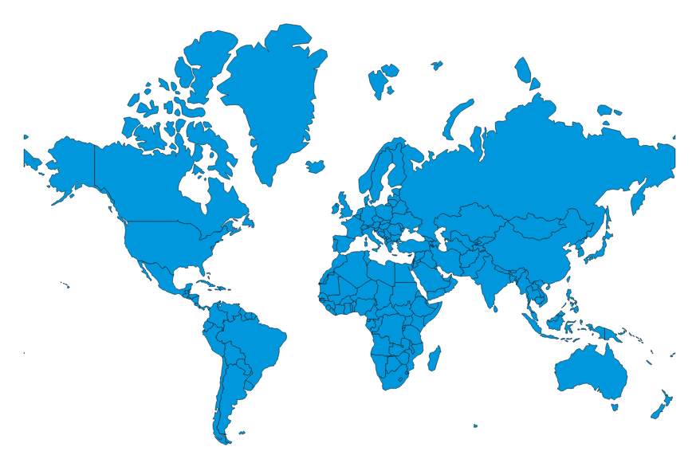

Data Driven Documents or precisely D3 is a JavaScript library developed by Mike Bostock with an idea of adding animation and interactivity to the way data is presented in web applications. If you ask many D3 experts to summarize what the library can do, something similar to “used to manipulate the DOM based off data” will resonate in all answers you get.

Being built off JavaScript, SVG, CSS and HTML, D3 is a very powerful library with a variety of use cases. In this immensely curated blog post, I’ll take you through one particularly thrilling use case: map-making :) Yes, we are going to visualize world cup geo data with perhaps the most opinionated open source data visualization tool out there.

In this tutorial, what we’ll be doing is quite simple: add circles to countries on the world map that have hosted the prestigious tournament before. The size of the circles is directly proportional to the attendance of that particular world cup event. Countries that have hosted the tournament more than once will have more than one circle and we’ll add them in a way that these circles are distinct from each other.

## Maps in D3

D3’s use cases are not just limited to DOM manipulation. It is also a very powerful JavaScript library for handling geographic information. There are already GeoJSON data files for common geographies, the most common being the entire world and the US. Say you want to draw a world map, you will need to supply JSON data from a GeoJSON file that contains the outlines of all the countries.

Enough of the talking, let’s get our hands dirty!

<iframe src='https://gfycat.com/ifr/GraveUnpleasantHen' frameborder='0' scrolling='no' allowfullscreen width='100%' height='404'></iframe>

Like I explained in my [previous tutorial](https://asabahebwa.com/getting-started-with-react-and-d3-interactive-bar-chart) about getting started with React and D3, mainly two approaches are used in making custom data visualizations with these tools. In this tutorial, we shall use React for the DOM, D3 for the math meaning that D3 will do all the heavy lifting and React will just render the DOM elements.

First things first! We need to bootstrap our React project with create-react-app. Create-react-app is a painless way to set up a modern web app with just one command. Assuming you have a projects directory on your computer, navigate to it using your terminal and run `npx create-react-app nameofapp` After the installation process is done, navigate to your app folder and run `yarn add d3` or `npm i d3` to add D3 for npm users. The former is for yarn users.

### `App.js`

    import React from "react";
    import WorldMap from "./WorldMap";
    class App extends React.Component {
    constructor(props) {
        super(props);
        this.state = {
        data: {
            geoData: null,
            cupData: null
        }
        };
    }
    componentDidMount() {
    Promise.all([fetch("https://raw.githubusercontent.com/ahebwa49/geo_mapping/master/src/world_countries.json"),fetch("https://raw.githubusercontent.com/ahebwa49/geo_mapping/master/src/world_cup_geo.json")]
    .then(responses => Promise.all(responses.map(resp => resp.json())))
    .then(([geoData, cupData]) => {
    this.setState({
        data: {
        geoData: geoData,
        cupData: cupData
        }
    });
    })
    .catch(error => console.log(error));
    }
    render() {
    const { data } = this.state;
    return 
{data.geoData && <WorldMap data={data} />}
;
    }
    }
    export default App;

The code snippet above shows the file content of the App.js file in my project folder. Quite simple code, right :) What’s really happening here is that we are fetching both world cup data and geo data showing outlines of all the countries from an external resource with the help of [JavaScript Promises](https://developer.mozilla.org/en-US/docs/Web/JavaScript/Reference/Global_Objects/Promise). This data is stored in state and passed onto `WorldMap.js` child component for further processing with D3.

### `WorldMap.js`

    import React from "react";
    import * as d3 from "d3";

    const margin = 75;
    const width = 1200 - margin;
    const height = 650 - margin;

    class WorldMap extends React.Component {
    componentDidMount() {
        const { data } = this.props;
        const svg = d3
        .select(this.refs.chart)
        .append("svg")
        .attr("width", width)
        .attr("height", height)
        .append("g");

        const projection = d3
        .geoMercator()
        .scale(130)
        .translate([width / 2, height / 1.4]);

        const path = d3.geoPath().projection(projection);

        const map = svg
        .selectAll("path")
        .data(data.geoData.features)
        .enter()
        .append("path")
        .attr("d", path)
        .style("fill", "rgb(9, 157, 217)")
        .style("stroke", "black")
        .style("stroke-width", 0.5);

        const nested = d3
        .nest()
        .key(d => d.year)
        .rollup(leaves => {

            const total = d3.sum(leaves, d => d.attendance);
            const coords = leaves.map(d => projection([+d.long, +d.lat]));
            const center_x = d3.mean(coords, d => d[0]);
            const center_y = d3.mean(coords, d => d[1]);
            return {
            attendance: total,
            x: center_x,
            y: center_y
            };
        })
        .entries(data.cupData);

        const attendance_extent = d3.extent(nested, d => d.value["attendance"]);

        const rScale = d3
        .scaleSqrt()
        .domain(attendance_extent)
        .range([0, 8]);

        svg
        .append("g")
        .attr("class", "bubble")
        .selectAll("circle")
        .data(nested.sort(function(a, b) {
    return b.value["attendance"] - a.value["attendance"];
            })
        )
        .enter()
        .append("circle")
        .attr("fill", "rgb(247, 148, 42)")
        .attr("cx", d => d.value["x"])
        .attr("cy", d => d.value["y"])
        .attr("r", d => rScale(d.value["attendance"]))
        .attr("stroke", "black")
        .attr("stroke-width", 0.7)
        .attr("opacity", 0.7);
        }

        render() {
        const { data } = this.props;
        const styles = {
            container: {
            display: "grid",
            justifyItems: "center"
            }
        };
    return (
            

            
Historical FIFA world cup geo map with React and D3.
            

            

            );
        }
        }
    export default WorldMap;

Okay, I agree that’s probably too much code to process at the moment, just hold your horses. I’m taking you through all that magic :) one step at a time.

## Step 1 — Adding React and D3

    import React from "react";
    import * as d3 from "d3";

    const margin = 75;
    const width = 1200 - margin;
    const height = 650 - margin;

This is by far the easiest step of this task and pretty sure majority of you are comfortable. It just involves adding both React and D3 to the file and initializing the `margin`, `width` and `height` variables.

## Step 2 — Add a container to render the map

    render() {

    const { data } = this.props;

    const styles = {
            container: {
            display: "grid",
            justifyItems: "center"
            }
        };

    return (
            

            
Historical FIFA world cup geo map with React and D3.
            

            

            );
        }

Inside the `render` method , we get data off props and then define the styles for div being rendered. We add a chart ref to the same container.

## Step 3 — Append an svg to the container

    const svg = d3
        .select(this.refs.chart)
        .append("svg")
        .attr("width", width)
        .attr("height", height)
        .append("g")

At the start of the highlighted code snippet inside componentDidMount lifecycle method, we select the root element in the render method with the help D3’s `select()` method, React refs and append an svg element to it. D3 has the `attr()` method to add any HTML attribute to an element, including a class name. In the code snippet above, we add the width, height and a group element to the svg.

## Step 4 — Create a path Object

    const projection = d3
        .geoMercator()
        .scale(130)
        .translate([width / 2, height / 1.4]);

    const path = d3.geoPath().projection(projection);

To draw our world map in D3, first, we need to set up the Mercator projection. Given a coordinate of longitude and latitude, the Mercator projection will spit back an x and y pixel. To create the svg object that will represent the polygon of our map, we use D3’s `geoPath` method. Next, we need to draw the svg path to actually visualize the map.

## Step 5 — Draw the svg path

    const map = svg
        .selectAll("path")
        .data(data.geoData.features)
        .enter()
        .append("path")
        .attr("d", path)
        .style("fill", "rgb(9, 157, 217)")
        .style("stroke", "black")
        .style("stroke-width", 0.5);

At the start of the highlighted code snippet, we are selecting all the path elements in the svg and bind our GeoJSON data to this empty selection. The `.features` key corresponds to the array of country co-ordinates. We then make the enter selection and append a path element that has it’s d property set to the path object created above.

At this point in time, we should be able to see a world map with all the countries. To better position the map, we make use of the scale and translate functions on the projection. To make the map more readable, I changed the fill of the countries from black to blue. I also changed the outline of each country to black and reduced it’s stoke width.

In your browser, you should be having something similar to this;

You should be quite proud of what you’ve accomplished so far!

## Step 6 — Adding context

    const nested = d3
        .nest()
        .key(d => d.year)
        .rollup(leaves => {

            const total = d3.sum(leaves, d => d.attendance);

            const coords = leaves.map(d => projection([+d.long, +d.lat]));

            const center_x = d3.mean(coords, d => d[0]);

            const center_y = d3.mean(coords, d => d[1]);

            return {
            attendance: total,
            x: center_x,
            y: center_y
            };
            })
        .entries(data.cupData);

In this step, we are going to be plotting circles on each country where the world cup was hosted with the radius directly proportional to the total attendance that year. This is often referred to as thematic mapping. First, we shall need to group our games by the year they were held since the start. This will help us compare attendance between various years in which the world cup was held.

To do this, we shall make use of the d3 function, `nest` . It will group our data and perform some aggregation on it. As you can see in the above code snippet, the nest function has got two main pieces. `.key` function and `.rollup` function are both called on the nest object. To specify how to group our data, we make use of the `.key` function in our case telling it to group our data by year of the world cup. `.rollup` function gets passed a variable which in our case we called leaves. It is a set of data organised by the group we previously specified. The last function on the nest object ( `.entries`) will pass our data through the nest pipeline.

Going back to our rollup function, we need 3 things from each of these groups:

- Sum of attendance for a specific year

- Longitude of where to draw the circle on our map

- Latitude of where to draw the circle on our map

To get the sum of all the attendances, we make use of D3’s sum method which takes in the leaves variable and an accessor function that defines what to actually sum.

To get the co-ordinates, we map over each element of the leaves grouping and whatever we return gets stored in an array called `coords`. Note that this is the pixel version of the coordinates that we get from our projection.

Since we have all the co-ordinates of the games in an array, we can use D3’s mean function to compute the average. This function follows the same pattern where we pass it some array and a call back function that defines the operation we want to perform. We use this function to get both the x and y pixel co-ordinates of a specific year.

Lastly, we return an object that will get stored in the final result returned from the rollup function.

## Step 7 — Plotting a circle on the map

If you’ve read until this point, just hold your horses. I’m on the home stretch :)

    const attendance_extent = d3.extent(nested, d => d.value["attendance"]);

        const rScale = d3
        .scaleSqrt()
        .domain(attendance_extent)
        .range([0, 8]);

    svg
        .append("g")
        .attr("class", "bubble")
        .selectAll("circle")
        .data(nested.sort(function(a, b) {
    return b.value["attendance"] - a.value["attendance"];
            })
        )
        .enter()
        .append("circle")
        .attr("fill", "rgb(247, 148, 42)")
        .attr("cx", d => d.value["x"])
        .attr("cy", d => d.value["y"])
        .attr("r", d => rScale(d.value["attendance"]))
        .attr("stroke", "black")
        .attr("stroke-width", 0.7)
        .attr("opacity", 0.7);

Before drawing the circles on a map, we create a radius scale with D3’s `scaleSqrt` method. This method has got two main pieces, `.domain` which takes in an array of min and max attendance values calculated from D3’s `extent` method. `.range` which also takes in an array of the min and max circle sizes in pixels.

The process of overlaying circles on our map is identical to what we did on adding paths. The only difference here is that we shall be using the nested data. We first append a group which we then label with class bubble. We select all circles in that group which is so far empty, bind data to those circles resulting in empty placeholders, we then make an enter selection corresponding to all the empty place holders with data bound to them and for each of those, we append a circle on our map. The data bound is sorted in descending order so that small circles don’t appear below the large circles for the countries that hosted the world cup more than once. Other familiar circle attributes are added as shown in the code snippet to add styling and improve the appearance of the visualization.

And yes! We are done here … Not too tough, Huh!…

<iframe src='https://gfycat.com/ifr/GraciousShyKid' frameborder='0' scrolling='no' allowfullscreen width='100%' height='404'></iframe>

## Conclusion

This is just part 1 of 2 series on how to create map visualizations with React and D3. You should watch out for the second part of this tutorial where we shall be adding animation and interaction.

I also hope you got a great insight on how to visualize map data with React and D3. If you understand these types of grouping and aggregates, it will allow you to create very powerful interactive graphics.

**If you enjoyed reading this, you may also enjoy some of my other blogs:**

- [Getting started with React and D3 — interactive Bar Chart.](https://asabahebwa.com/getting-started-with-react-and-d3-interactive-bar-chart)

- [Make a clever bitcoin price chart with React and D3.](https://asabahebwa.com/getting-started-with-react-and-d3-interactive-bar-chart)
