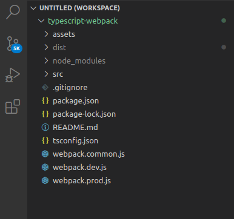
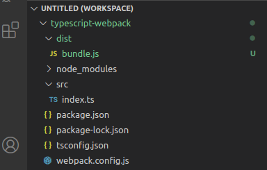
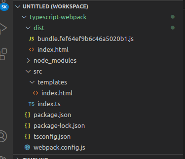
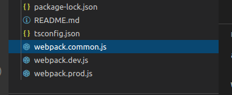

TypeScript is an open-sourced language developed and maintained by Microsoft. First released in October 2012, its development was overseen by Anders Herlsberg who also had a big role in the creation of C# language. TypeScript is a typed superset of JavaScript that compiles to plain JavaScript.

You might be wondering… **why TypeScript?** Well, JavaScript is a dynamic language with no type system and doesn’t support some object-oriented features in languages like C# and Java that make it easy to build complex applications with large teams working on the same code. The type system increases the code quality, readability, and makes it easy to maintain and refactor the codebase. More importantly, errors can be caught at compile time rather than at runtime.

So… **what is webpack?** At its core, webpack is a static module bundler for modern JavaScript applications. When webpack processes your application, it internally builds a [dependency graph](https://webpack.js.org/concepts/dependency-graph) which maps every module your project needs and generates one or more bundles, in simple language, it’s a tool that will resolve all the ECMAScript 2015+ module dependencies, transpile the source code using Babel, bundle all the JavaScript files into a single one, and also make the code compatible with the browser or Node.js.

In this well-thought article, I will show you how to set up a TypeScript project from scratch using webpack. As of today, TypeScript 4.0 is the latest release and it’s what we shall be using. At the end of this article, you should be having the following project structure

## Setup

Navigate to anywhere on you feel comfortable creating projects on your computer and create a project folder with the `mkdir` command. Such as `mkdir typescript-webpack`. Inside the newly created project folder, Run `npm init -y` to add a package.json file with default values. If you want to initialize git so that you can keep your repo on GitHub or similar, run `git init` in the same project folder.

Add webpack, webpack-cli, typescript and ts-loader as dev dependencies using the command `npm i webpack webpack-cli typescript ts-loader -D`

Next, we’ll go ahead and configure typescript for the project using the _tsconfig.json_ file. The _tsconfig.json_ file is a simple file in JSON format where we can specify various options to tell the compiler how to compile the current. Go ahead and create a new file in the root directory and name it _tsconfig.json_ and add the following configuration.

    {
    "compilerOptions": {
        "outDir": "./dist/",
        "noImplicitAny": true,
        "sourceMap": true,
        "module": "ESNext",
        "moduleResolution": "node",
        "allowSyntheticDefaultImports": true,
        "experimentalDecorators": true,
        "noUnusedLocals": false,
        "noUnusedParameters": false,
        "target": "es5",
        "typeRoots": [
        "node_modules/@types",
        "typings"
    ]
    },
        "include": [
        "src/**/*.ts"
    ]
    }

## Webpack

Let’s go ahead and add some basic webpack configuration. Add a _webpack.config.js_ file in the root directory and add the following configuration.

    const path = require('path');

    module.exports = {
    mode: "production",
    entry: path.resolve(__dirname, './src/index.ts'),
    module: {
        rules: [
        {
            test: /\.tsx?$/,
            use: 'ts-loader',
            exclude: /node_modules/,
        },
        ],
    },
    resolve: {
        extensions: ['.tsx', '.ts', '.js'],
    },
    output: {
        filename: 'bundle.js',
        path: path.resolve(__dirname, 'dist'),
    },
    };

### Some points to note:

- By default, the webpack mode is production where your code will be minified.

- An entry point indicates which module webpack should use to begin building out its internal [dependency graph](https://webpack.js.org/concepts/dependency-graph/). webpack will figure out which other modules and libraries that entry point depends on (directly and indirectly).

- The output property tells webpack where to emit the bundles it creates and how to name these files. It defaults to _./dist/main.js_ for the main output file and to the _./dist_ folder for any other generated file.

- Out of the box, webpack only understands JavaScript and JSON files. Loaders allow webpack to process other types of files and convert them into valid [modules](https://webpack.js.org/concepts/modules) that can be consumed by your application and added to the dependency graph.

Modify the script in the package.json file so that we can run webpack

    "scripts": {
        "build": "webpack"
    },

Add some code to the _index.ts_ file inside the src folder.

    window.addEventListener("load", () => {
    const header = document.createElement("h1");
    header.innerText = "Webpack❤️TS"

    const body = document.querySelector("body");
    body.appendChild(header);
    })

Build the project with `npm run build` and ALAS! We’ve made it, Yey🚀

**Not quite yet…**

It’s great we have a _bundle.js_ file in our dist folder, right?! Because we can now easily reference it in our HTML file, but the greater news is that webpack has a better way for us to accomplish this :)

## HTML templates

First of all, we need to add some development dependencies. Move to your terminal and run `npm i -D html-webpack-plugin clean-webpack-plugin` Go ahead and also create a template folder in the src folder where we shall add the HTML template.

    src/templates/index.html

Add this code

    <!doctype html>
        <html lang="en">
        <head>
            <meta charset="UTF-8">
            <meta name="viewport"
                content="width=device-width, user-scalable=no, initial-scale=1.0, maximum-scale=1.0, minimum-scale=1.0">
            <meta http-equiv="X-UA-Compatible" content="ie=edge">
            <title>Webpack❤️TS</title>
        </head>
        <body>
        </body>
        </html>

## Plugins

Inside the _webpack.config.js_ file, we shall make use of the two plugins that we added as dev dependencies i.e

- **html-webpack-plugin** — This plugin simplifies the creation of HTML files to serve your webpack bundles. This is especially useful for webpack bundles that include a hash in the filename which changes every compilation.

- **clean-webpack-plugin** — In general it’s good practice to clean the /dist folder before each build so that only used files will be generated. This plugin will take care of that.

Inside the _webpack.config.js_ file, add the following changes

    const HtmlWebpackPlugin = require('html-webpack-plugin');
    const {CleanWebpackPlugin} = require("clean-webpack-plugin");
    ...
    module.exports = {
    ...
    output: {
        filename: 'bundle.[hash].js', // <- ensures unique bundle name
        path: path.resolve(__dirname, 'dist'),
    },
    plugins: [
        new CleanWebpackPlugin(),
        new HtmlWebpackPlugin({
        template: path.resolve(__dirname,"./src/templates/index.html")
        })
    ]
    };

Note that the output filename now includes a `[hash]` This will ensure a unique name every time we compile.

Building again by running `npm run build` in the terminal will generate a new bundle with a hash as well as an HTML file in the dist folder.

    /dist/index.html

A reference to the created bundle is added as you can see in the html file

    <!DOCTYPE html>
    <html lang="en">
    <head>
    <meta charset="UTF-8" />
    <meta name="viewport"
    content="width=device-width,user-scalable=no,initial-scale=1,maximum-scale=1,minimum-scale=1"
    />
    <meta http-equiv="X-UA-Compatible" content="ie=edge" />
    <title>TypeScript❤️Webpack</title>
    </head>
    <body>
    
    </body>
    </html>

This, what we’ve achieved so far is really cool, but we can even do better. Shall we?

## Webpack development server

[webpack-dev-server](https://github.com/webpack/webpack-dev-server) can be used to quickly develop an application. It has many helpful features such as live reloading or hot module replacement when you change something in your code and can be used to serve static assets too such as images :)

In this section, we’ll dive into some of the best practices and utilities for building a production site or application. The goals of development and production builds differ greatly and it is recommended to write separate webpack configurations for each environment.

While we will separate the production and development specific bits out, note that we’ll still maintain a “common” configuration to keep things DRY. In order to merge these configurations together, we’ll use a utility called [webpack-merge](https://github.com/survivejs/webpack-merge).

    npm install -D webpack-merge webpack-dev-server

create 3 webpack files in the root directory as shown in the picture below, i.e _webpack.common.js_, _webpack.dev.js_, and _webpack.prod.js_

    //webpack.common.js
    const path = require("path");
    const HtmlWebpackPlugin = require("html-webpack-plugin");
    const { CleanWebpackPlugin } = require("clean-webpack-plugin");
    const distPath = path.resolve(__dirname, "dist");
    module.exports = {
        entry: path.resolve(__dirname, "./src/index.ts"),
        module: {
        rules: [
        {
            test: /\.tsx?$/,
            use: "ts-loader",
            exclude: /node_modules/
        }
        ]
    },
    resolve: {
    extensions: [".tsx", ".ts", ".js"]
    },
    output: {
        filename: "bundle.[hash].js",
        path: distPath
        },
    plugins: [
        new CleanWebpackPlugin(),
        new HtmlWebpackPlugin({
        template: path.resolve(__dirname, "./src/templates/index.html")
        })
    ]
    };

Create an assets folder in the root folder where we’ll add static assets like images.

    //webpack.dev.js
    const { merge } = require("webpack-merge");
    const common = require("./webpack.common.js");
    const path = require("path");
    module.exports = merge(common, {
    devtool: "inline-source-map",
    mode: "development",
    devServer: {
        contentBase: path.join(__dirname, "assets"),
        publicPath: "/",
        compress: true,
        port: 9000
    }
    });

In the production config, we shall need to extra plugins to have some nifty stuff done under the hood, these are:

- **webpack-bundle-analyzer:** Helps us visualize the size of webpack output files with an interactive zoomable treemap.

- **terser-webpack-plugin:** This plugin uses [terser](https://github.com/terser-js/terser) to minify your JavaScript.

`npm i -D terser-webpack-plugin webpack-bundle-analyzer`

Inside webpack.prod.js, add

    //webpack.prod.js
    const { merge } = require("webpack-merge");
    const common = require("./webpack.common.js");
    const TerserPlugin = require("terser-webpack-plugin");
    const BundleAnalyzerPlugin = require("webpack-bundle-analyzer").BundleAnalyzerPlugin;
    module.exports = merge(common, {
    optimization: {
    minimize: true,
    minimizer: [
        new TerserPlugin({
            terserOptions: {
            ecma: undefined,
            warnings: false,
            parse: {},
            compress: {},
            mangle: true,
            module: false,
            output: null,
            toplevel: false,
            nameCache: null,
            ie8: false,
            keep_classnames: undefined,
            keep_fnames: false,
            safari10: false
            }
        })
        ]
    },
    plugins: [new BundleAnalyzerPlugin()],
    devtool: "none",
    mode: "production"
    });

We also have to update the npm script to make sure that the proper configuration file is used.

    "scripts": {
        "start": "webpack-dev-server --config webpack.dev.js",
        "build": "webpack --config webpack.prod.js"
    },

Running `npm start` will make the project available on http://localhost:9000

## Adding Styles with webpack

We’ll need only two webpack plugins to comfortably add styles to our project.

    npm i css-loader mini-css-extract-plugin -D

Let’s add them to the _webpack.common.js_:

    // webpack.common.js
    ...
    const MiniCssExtractPlugin = require('mini-css-extract-plugin');

    module.exports = {
    ...
    module: {
        rules: [
        ...
        {
            test: /\.css$/i,
            use: [
            MiniCssExtractPlugin.loader,
            'css-loader'
            ],
        },
        ],
    },
    plugins: [
        ...
        new MiniCssExtractPlugin({filename: "styles.[hash].css"})
    ]
    };

Create a _styles.css_ file inside the src folder and add some basic styles

    /src/styles.css

Add

    body {
        margin: 0;
        border: 1px solid red;
    }

import it in the _index.ts_ file

Inside `/src/index.ts`

Add

    import "./styles.css";
    ...

The styles will be added to the html file. Run npm start for development build and npm run build for the production build.

The code can be found on [my github repo](https://github.com/ahebwa49/typescript-webpack-setup).

#Congratulations!!

<iframe src='https://gfycat.com/ifr/ImaginativeAdmirableInchworm' frameborder='0' scrolling='no' allowfullscreen width='100%' height='486'></iframe>
