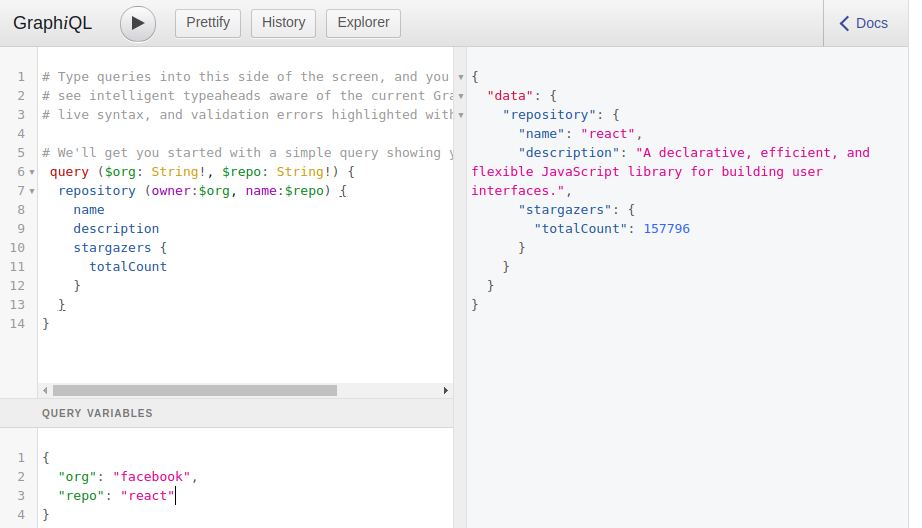

GraphQL is an open-source web-API language for reading(querying) and writing(mutating) data developed and maintained by the engineers at Facebook. You might be wondering… why GraphQL? Well, It allows specific data to be returned and allows fetching data from multiple areas all in a single request.

A quick background check shows that GraphQL has:

- Over 4,000,000 weekly downloads.
- Over 7,000 dependent packages.
- Over 116 releases to date.
- Over 16,000 stars on GitHub.
- And it has been around for close to 5 years now since it’s public release.

GraphQL has recently gained popularity over REST mainly because:

- With REST, gathering a good amount of information would typically involve accessing multiple endpoints which isn’t the same GraphQL, you’d only be required to make one query with your requirements and the server would respond with a JSON object fulfilling all your requirements.

- Over fetching or under fetching of data. With REST, it’s very hard to design an endpoint that will return just data the client will need. Say you want to get users names from a REST API, you’ll probably hit the `/users` endpoint that will retrieve so much more information about the users like age or sex that isn’t necessarily needed by the client at that point.

- GraphQL has the benefits of a schema and type system. It uses a strong type system to define the capabilities of an API.

### GraphQL Queries

Generally, a query is about asking for a specific field on an object. Say you’ve got a person object with a few properties on a GraphQL server, retrieving the person’s name might be as simple as writing the expression below.

    {
        person {
            name
        }
    }

### GraphQL Mutations

Just like in REST APIs, many times all we want is to consume data from the backend, but there are also scenarios where we want to modify/add data to on the server for example adding user details, staring a GitHub repository, etc. This is what GraphQL mutations are all about.

Before, getting started with Apollo, a GraphQL client, I’ll walk you through making queries and mutations in a playground so that you have a feel of how to retrieve data with GraphQL queries. We shall make use of [GitHub’s GraphQL API explorer](https://developer.github.com/v4/explorer/) as our playground so if you haven’t already, please sign up on GitHub as it makes use of your real, live production data.

To get started, open [GitHub GraphQL API Explorer](https://developer.github.com/v4/explorer/) in a new tab. We are going to get basic information about our GitHub account with basic query syntax.

On the left side of the explorer, copy and paste the following syntax and click the Execute Query button just above it.

    query {
        viewer {
            name
        }
    }

A JSON object with your full name will be returned on the right side of the explorer as shown below.

Congrats! You made your first query 🚀

A few points to note though:

- We start a query with the query keyword(it’s actually optional)
- viewer is the name of the object we want to get and name is a property on that object.

### Query parameters

Now, let’s make a more complicated query with query parameters :). We’ll search for a GitHub repository with a specific name and owner and return more information about it such as the description and number of stars.

On the left side of the explorer, copy and paste the following syntax and click the Execute Query button just above it.

    query ($org: String!, $repo: String!) {
        repository (owner:$org, name:$repo) {
            name
            description
        stargazers {
            totalCount
            }
        }
    }

At the left bottom side of the explorer, add the query parameters as shown below.

    {
        "org": "facebook",
        "repo": "react"
    }

Click the Execute Query button and watch out for the returned JSON object.

**Some points to note here:**

- This time around, we are asking for the repository object but passing two parameters i.e owner and name. We defined the two variables in the query keyword, which essentially allows parameters to be passed into it. Each parameter is defined by declaring its name with its type after a semicolon. The variable names need to be prefixed with \$. The ! after the type signifies that this is a required parameter.

- We are asking for the name, description, and number of stars of the repository to be returned.

This, what we’ve done so far is enough for exploring with GraphQL queries, we’ll dive into querying data from a React and TypeScript application.

This application will return some information about our GitHub account but before we do that, we need to generate a GitHub personal access account.

## Generating a GitHub personal access token

GitHub requires us to generate a personal access token before having access to the GitHub GraphQL server. Please follow the steps below to generate one for yourself.

1. Log in to your GitHub account if you haven't and navigate to your settings page.
2. At the near bottom of the left-hand menu, select developer settings. You will be redirected to the developer settings page.
3. Select personal access tokens on the left-hand menu.
4. Select generate new token. You’ll be prompted to enter your password.
5. Enter any token note/description then select a scope for the token. For the scope, check `repo` and `user` and generate the token.
6. A new token is generated. Copy it as it’s what we shall be using in our application.

That's it about generating the token. Now, to hit the ground running, let’s bootstrap a TypeScript and react project using create-react-app. Navigate to your projects folder or anywhere you want to place the project folder on your machine and run the command below.

    npx create-react-app my-graphql-api --template typescript

Please note that I’ll keep using yarn for adding dependencies throughout this article. However, you should feel free to use npm.

We need to first of all add apollo to our project, add the following packages

    yarn add apollo-boost react-apollo graphql

**A few points to note here:**

- `apollo-boost` contains everything we need to set up our Apollo client.
- `react-apollo` contains React components we are going to use to interact with the GraphQL server.
- `graphql` is a core package that we'll use to parse GraphQL queries.

We also need to add TypeScript types for graphql as a dev dependency i.e

    yarn add -D @types/graphql

Inside the project’s src folder, create a Header.tsx file and add a Header functional component that will contain your name and avatar from GitHub.

    import React from 'react';

    export const Header: React.SFC = () => {
        return null;
    };

We then need to create two interfaces i.e IViewer for the viewer data and IQueryResponse, for the response we get back from the GraphQL server. Let’s add the code just below the import statement in the Header.jsx file.

    interface IViewer {
        name: string;
        avatarUrl: string;
    }

    interface IQueryResult {
        viewer: IViewer;
    }

Import the header component into App.tsx file and add it to the jsx as shown below.

    const App: React.SFC = () => {
        return (
            

                <header className="App-header">
                    <Header />
                </header>
            

        );
    };
    export default App;

### Adding Apollo provider

Inside `App.tsx`, import ApolloClient from the apollo-boost package and ApolloProvider from react-apollo as shown below.

    import ApolloClient from 'apollo-boost';
    import { ApolloProvider } from 'react-apollo';

We are going to use ApolloClient to create our client and ApolloProvider will wrap our entire App passing in the client as a prop.

    const client = new ApolloClient({
        uri: 'https://api.github.com/graphql',
        headers: {
            authorization: `Bearer your-token`,
        },
    });

Next, we use ApolloProvider to provide the client that we have created.

Our App.tsx file should now be looking like this:

    import React from 'react';
    import ApolloClient from 'apollo-boost';
    import { ApolloProvider } from 'react-apollo';
    import { Header } from './Header';
    import './App.css';

    const client = new ApolloClient({
        uri: 'https://api.github.com/graphql',
        headers: {
            authorization: `Bearer your-token`,
        },
    });

    const App: React.SFC = () => {
        return (
            <ApolloProvider client={client}>
                

                    <header className="App-header">
                        <Header />
                    </header>
                

            </ApolloProvider>
        );
    };

### Using the Query component to query GraphQL

It’s time to make some queries 😋

Inside the Header.tsx file, import Query from react-apollo and gql from graphql-tag as shown below.

    import { Query } from 'react-apollo';
    import gql from 'graphql-tag';

Just below the interfaces in the same file, we’re going to define our query using gql.

    interface IViewer {
        ...
    }

    interface IQueryResult {
        ...
    }

    const GET_VIEWER = gql`
        {
            viewer {
                name
                avatarUrl
            }
        }
    `;

Let’s use our Query component from react-apollo to invoke our query in the files’ return value.

    return (
        <Query<IQueryResult> query={GET_VIEWER}>
            {({ data, loading, error }) => {
                if (!data || !data.viewer) {
                    return null;
                    }
                if (error) {
                    return 
{error.toString()}
;
                    }
                if (loading) {
                    return 
Loading ...
;
                    }
                return (
                    

                        
                        
{data.viewer.name}

                        <h1>GitHub Search</h1>
                    

                );
            }}
        </Query>
    )

**Some points to note here:**

- The result of the query is returned in the render-prop function of the Query component. This component wraps the JSX and passed a query prop which is the actual query as shown above. It also takes the type of data to be returned.
- Destructuring the result of the render prop gives us data, loading, and error states. The data is the actual result we are looking for. This render prop will return JSX with the viewer name and avatar URL. If we don’t have the data, it will return null. If we have an error, a div showing the error will be returned. If the data is still loading, it will also be shown.

Let’s add the .avatar class we just referenced to App.css

    .avatar {
        width: 120px;
        border-radius: 50%;
    }

That’s it for now …You’ve built a basic TypeScript and ReactJS application querying data from a GraphQL server 🚀. If you run your application, you should be seeing similar to what I have below.

Thanks for reading up to this point and I really hope you enjoyed this article and learned something from it. Watch out for part 2 of this article where we shall dive into GraphQL Mutations. The code for this article can be found in [this GitHub repository](https://github.com/ahebwa49/my-graphql-api).

I have a keen interest in data visualization with React and D3. If you follow me [on Twitter](https://twitter.com/lasabahebwa), I won’t waste your time.

<iframe src='https://gfycat.com/ifr/NextNaughtyBubblefish' frameborder='0' scrolling='no' allowfullscreen width='100%' height='364'></iframe>

