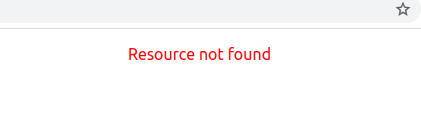

In TypeScript/JavaScript, we have an unopinionated library that can help us interact with RESTful APIs, Axios. In this article, we’ll look at the popular open-source library and how it compares with the native browser function(fetch) and we’ll discover the additional features that the open-source library has over fetch. We will also look at how we can interact with a REST API using function-based components.

Axios is a very popular promise-based HTTP client over fetch because it:

- Allows cancelling of requests.
- Allows request timeout.
- Enjoys built-in XSRF protection.
- Performs automatic transforms of JSON data.
- Has wide browser support etc.

On the other hand, TypeScript is an open-source superset of JavaScript that can help us avoid painful bugs that developers commonly run into when writing JavaScript by type-checking the code. The type system increases the code quality, readability, and makes it easy to maintain and refactor the codebase. More importantly, errors can be caught at compile time rather than at runtime.

TypeScript has :

- Over 14,000,000 weekly downloads on npm.
- Over 65,000 stars on GitHub.
- Over 1,700 releases to date.
- Over 18,000 dependent packages.
- And it’s been around for some good 8 years now.

We’ll need:

- [jsonplaceholder.typicode.com](http://jsonplaceholder.typicode.com/): We will use this online service to help us learn how to interact with a RESTful API.

First things first, let’s bootstrap a typescript and react project using create-react-app. Navigate to your projects folder or anywhere you want to place the project folder on your machine and run the command below if you are using yarn.

    yarn create react-app my-api --template typescript

If you are using npm, it’s very similar as shown below.

    npx create-react-app my-app --template typescript

Please note that I’ll keep using yarn for adding dependencies throughout this article. However, you should feel free to use npm.

Move into the project directory and add Axios. Note that Axios has got typescript types within it so we don’t have to install them separately.

    yarn add axios

Open the `App.tsx` file in the src folder and import the Axios library to the project.

    import axios from 'axios';

We’re going to be fetching posts from a REST API and it’s good practice to first create an interface for the posts that we’re going to be dealing with. A post has got an id, title, body, and an optional userId property. Let’s create an interface for the post just below the Axios import as shown below.

    interface IPost {
        userId: number;
        id?: number;
        title: string;
        body: string;
    }

Next, we create a defaultPosts variable that will hold the state for the posts that we shall populate later on after retrieving them from the API. Initialize this variable just below the post interface as shown below.

    const defaultProps:IPost[] = [];

Next, let’s define a react App function component below the defaultProps variable.

    const App: React.SFC = () => {}

We then make use of React’s `useState` hook to define and initialize the pieces of state .i.e loading, posts, and error state inside the function component.

    const [posts, setPosts]: [IPost[], (posts: IPost[]) => void] = React.useState(defaultPosts);
    const [loading, setLoading]: [boolean, (loading: boolean) => void] = React.useState<boolean>(true);
    const [error, setError]: [string, (error: string) => void] = React.useState("");

### A few things to note here:

- Note that to define a type for `React.useState()` as for the loading state, you must add a `<type>` after typing the word useState and before the opening parenthesis. This will tell TypeScript that you’re giving a specific type to state property variable.

To make a call to the REST API when the component has mounted, we make use of React’s `useEffect` function after the lines where the state is defined in our application. Pass in an arrow function as the first parameter and an empty array as the second parameter as shown below.

    React.useEffect(() => {
    // TODO - get posts
    }, []);

To get the posts from the REST API, we call `axios.get()` which is a generic function that accepts a response body as a parameter.

    React.useEffect(() => {
    axios
        .get<IPost[]>("https://jsonplaceholder.typicode.com/posts");
    }, []);

Adding HTTP request headers to the request will require us to add a second parameter to the function. The JSONPlaceholder we are currently interacting with doesn’t require the request headers but other REST APIs might need them.

    React.useEffect(() => {
    axios
        .get<IPost[]>("https://jsonplaceholder.typicode.com/posts", {
        headers: {
            "Content-Type": "application/json"
        },
        });
    }, []);

At this point, we’ve got to handle the response from the promise by setting response data to the posts array in state and setting loading to false.

    React.useEffect(() => {
    axios
        .get<IPost[]>(...)
        .then(response => {
        setPosts(response.data);
        setLoading(false);
        });
    }, []);

We also have to take care of the errors as well as set loading to false. This happens in the catch method

    React.useEffect(() => {
    axios
        .get<IPost[]>(...)
        .then(...)
        .catch(ex => {
        const error =
        ex.response.status === 404
            ? "Resource not found"
            : "An unexpected error has occurred";
        setError(err);
        setLoading(false);
        });
    }, []);

Add a return statement to our App functional component just below `React.useEffect` so that we can map over the returned posts and display them with jsx.

    return (
    

    <ul className="posts">
        {posts.map((post) => (
        <li key={post.id}>
        <h3>{post.title}</h3>
        
{post.body}

        </li>
    ))}
    </ul>
    {error && 
{error}
}
    

    );

We’ve made a reference to posts and error classNames. Let’s add the CSS to the index.css class

    .posts {
    list-style: none;
    margin: 0px auto;
    width: 800px;
    text-align: left;
    }

Error class

    .error {
    color: red;
    }

Now, if we run our application, it should look like this:

If we try to change the URL to something incorrect, an error in red will be shown on the screen as shown below.

### Timeouts

Timeouts after a specific period say 15 seconds will improve the user experience of our application, so let’s add a timeout to our request.

    React.useEffect(() => {
    axios
        .get<IPost[]>("...", {
        headers: {
            "Content-Type": "application/json"
        },
        timeout : 1
    }) 
    ...
    ;
    }, []);

We’ve added a timeout of just 1 millisecond :) With this, I’m very sure our request will timeout before the posts are fetched from the endpoint. Let’s now handle the timeout in the catch method.

    .catch(ex => {
    const error =
        ex.code === "ECONNABORTED"
        ? "A timeout has occurred"
        : ex.response.status === 404
            ? "Resource not found"
            : "An unexpected error has occurred";
        setError(err);
        setLoading(false);
    });

Now, navigating to our Application in the browser should show a timeout error as shown below.

After seeing that, change the timeout back to something realistic so that we can explore another concept in interacting with REST APIs.

### Canceling requests

Allowing users to cancel a request with Axios can help improve the user experience of our application. Let’s add this feature from Axios.

    import axios, { CancelTokenSource } from "axios";

We now need to generate the cancel token source and add it to the state before the `axios.get()` method is called. We’ll make use of React’s `useState` hook to define and initialize that piece of state.

    const cancelToken = axios.CancelToken; //create cancel token
    const [cancelTokenSource, setCancelTokenSource]: [CancelTokenSource,(cancelTokenSource: CancelTokenSource) => void] = React.useState(cancelToken.source());

Add the cancel token to the request headers inside the Axios get function as shown below.

    .get<IPost[]>("https://jsonplaceholder.typicode.com/posts", {
    cancelToken: cancelTokenSource.token,
    ...
    })

We handle cancellation requests in the catch method as shown below. If you've not yet, you’ll need to first of all set loading to false.

    .catch((err) => {
        const error = axios.isCancel(err)
        ? 'Request Cancelled'
        : err.code === 'ECONNABORTED'
        ...
    
        setError(err);
        setLoading(false);
    });

We make use of the isCancel method in Axios to check if the request has been canceled.

We’ll then have to add a cancel button inside the render method to allow a user to cancel the request.

    

    {loading && (
    <button onClick={this.handleCancelClick}>Cancel</button>
    )}
    <ul className="posts">...</ul>

We’ve now got to define the `handleCancelClick` that we’ve referenced on the `onClick` handler of the cancel button. Do this above `React.useEffect` method.

    const handleCancelClick = () => {
    if (cancelTokenSource) {
        cancelTokenSource.cancel("User cancelled operation");
    }
    };

**Some points we need to note here:**
- First, we check if the cancelTokenSource is available in the state, if so, we invoke the cancel method on it passing in a string.

- Users can now successfully cancel a request to an endpoint by clicking the cancel button. However, the process of fetching the data happens so fast that you’ll most likely won’t see cancellation in action. To replicate this, call

    `cancelTokenSource.cancel("User cancelled operation");`

just below the catch block of the promise-based function `axios.get` as shown below.

    axios
    .get<IPost[]>( ... )
    .then(response => { ... })
    .catch(ex => { ... });

    cancelTokenSource.cancel("User cancelled operation");

You should now be able to see the red string Request Cancelled in your Application :)

And that’s it for now … Thanks for reading up to this point and I really hope you enjoyed this article and learned something from it about interacting with REST APIs with TypeScript and Axios.

The code can be found on [my GitHub repo](https://github.com/ahebwa49/typescript-hooks-api).

I have a keen interest in data visualization with React and D3. If you [follow me on Twitter](https://twitter.com/lasabahebwa), I won’t waste your time.

<iframe src='https://gfycat.com/ifr/BeneficialOffensiveBittern' frameborder='0' scrolling='no' allowfullscreen width='100%' height='631'></iframe>